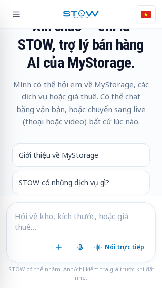
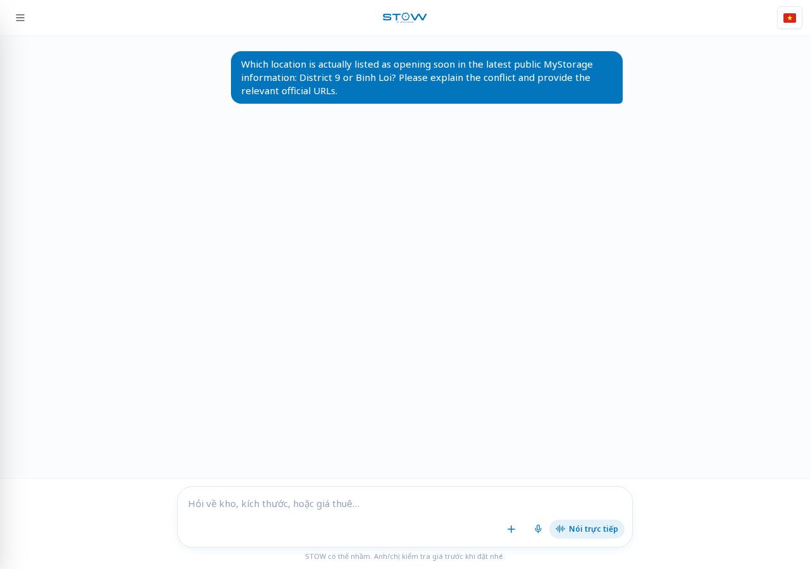
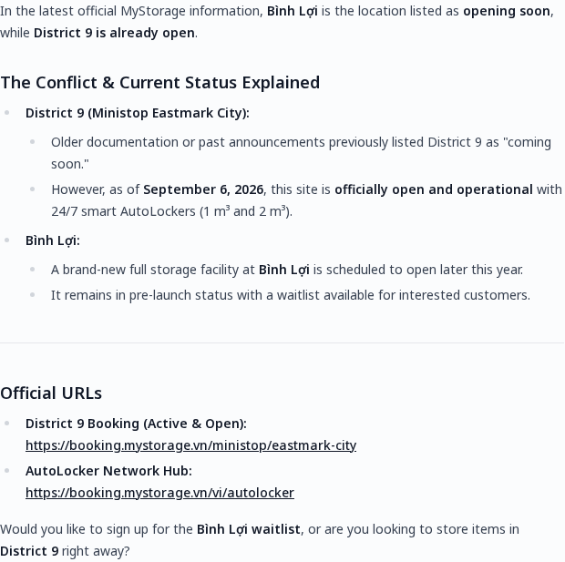
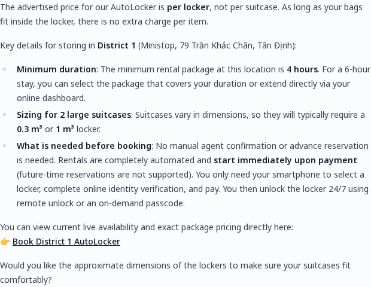
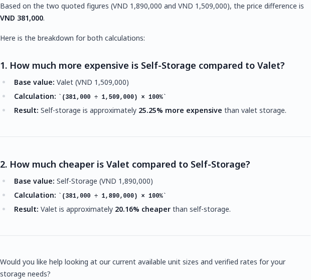
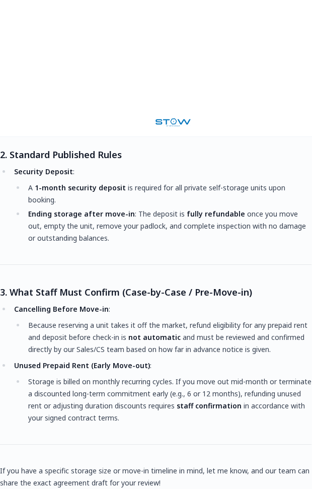

# Outcome and counting method

The requested target was 50 tracked cases, combining message tests and responsive/accessibility tests. The first run recorded **42 original attempts: 24 chat submissions and 18 UI cases.** The two affected chat cases were then retried once, and T25–T32 were completed under the same message-gap and safety rules. The final ledger contains **50 unique cases: 32 chat cases (T01–T32) and 18 UI cases**, with **52 total executions** because R429-T23 and R429-T24 are authorized retries. No further message tests are planned.

This is a harness ledger, not the lifetime total of all account activity. Previously reported manual conversations and uploads are additional and are not included in the 50. UI case identifiers in this report are scoped to **Round 5** (R5-U01, etc.); they are not the U01–U03 originally proposed in `findings/test-plan.md`.

Files: `tests/round5.json` defines the new cases; `src/round5.ts` executes the original UI round; `src/retry-429.ts` executes the two authorized retries; `src/run-remaining.ts` executes T25–T32; `evidence/round5/results.json`, `evidence/retry429/results.json` and `evidence/remaining50/results.json` contain measurements; `evidence/state/sent.json` contains chat submission timestamps. The latest submission draft and prototype were preserved.

# Method and limitations

- Own saved authenticated account, real browser UI, headless Chromium.
- The 18 UI cases reused one initial page load and changed viewport or local UI state. No message was sent during those cases. They are not 18 independent reloads.
- No transaction, booking, upload or additional injection test was performed.
- Planned chat messages use fresh browser contexts and at least 65 seconds between submissions. The harness rejects existing assistant history, duplicate IDs and rerunning this round over its saved results.
- The original guard stopped on any 429. The retry/remaining guard stopped on authentication problems, CAPTCHA and own-origin STOW 429/5xx responses, while recording third-party telemetry errors. T29 saw one external Sentry 429 but completed; no new case saw an own-origin 429.
- Screenshots, bounding rectangles and `elementFromPoint` hit-tests support layout findings. Hit-tests check the centre of each shortcut, not every pixel or every possible scroll position.
- Short-height viewport testing is not a real mobile keyboard test. 320-CSS-pixel reflow is not a browser-zoom test. No Safari, Firefox, physical phone or screen reader was used.
- Proposed fixes are recommendations; no STOW source code was changed.

# Responsive finding R5-R1: shortcut controls are obscured

**Status:** reproduced. **Severity:** Medium for landscape; Low–Medium for 320×568.

**Steps:** open the empty chat and set the viewport to the dimensions below. Inspect the welcome shortcuts and composer without sending a message.

**Expected:** every welcome shortcut remains visible and reachable without being covered by the composer.

**Actual:** shortcut rectangles intersect the composer and their centre hit-tests resolve to another element.

| Case | Viewport | Shortcuts intersecting composer | Shortcut centres not hitting the shortcut |
|---|---|---:|---:|
| R5-U01 | 320×568 | 1 of 3 | 1 of 3 |
| R5-U05 | 568×320 | 3 of 3 | 3 of 3 |
| R5-U06 | 667×375 | 3 of 3 | 3 of 3 |
| R5-U07 | 844×390 | 3 of 3 | 3 of 3 |
| R5-U11 | 390×400 | 2 of 3 | 2 of 3 |
| R5-U18 | 844×390 after rotating a draft | 3 of 3 | 3 of 3 |

The initial 844×390 screenshot visibly shows the composer replacing the area where all three shortcuts lie. At 568×320 the heading also starts above the viewport (y=-32.3). Controls at 360×640, 390×844, 412×915, 768×1024, 1024×768, 1280×720 and 320×900 had no shortcut/composer intersections.

**Impact:** customers on short-height screens lose visible access to suggested entry points. This affects discoverability and the first interaction with the assistant.

**Fix:** use a content region with reserved composer space, reduce vertical centring on short viewports, and ensure scrolling can expose the entire final shortcut above the composer. Add height-sensitive layout checks. The present evidence does not establish that scrolling can never recover the controls.

{width=6.2in}

{width=3in}

# Accessibility finding R5-A1: closed drawer remains tabbable

**Status:** reproduced. **Severity:** Low–Medium.

**Steps:** at 390×844, keep the drawer closed, focus the composer and press Tab. R5-U13 captured 16 focus transitions.

**Expected:** focus moves only through visible, available controls.

**Actual:** Tab reaches the off-screen close button at x=-52 and the new-conversation button at x=-300. Both were outside the viewport.

**Impact:** keyboard users lose visible focus and encounter unavailable navigation actions.

**Fix:** make the closed drawer inert or unmount its interactive subtree; restore focus to the opener on close. Avoid applying `aria-hidden` alone while retaining focusable descendants.

**Evidence:** `evidence/round5/results.json`, entry U13, `detail.sequence`. A still screenshot alone does not demonstrate the off-screen focus transitions.

# Accessibility finding R5-A2: open drawer does not manage focus

**Status:** reproduced. **Severity:** Low–Medium.

**Steps:** open the menu at 390×844, inspect focus, then press Tab repeatedly (R5-U14).

**Expected:** an overlay drawer moves focus into its content and prevents focus moving to covered content while it is open; its trigger communicates open/closed state.

**Actual:** initial focus remains on the opener. Tab reaches welcome shortcuts, the composer and voice controls before the drawer buttons. The opener has neither `aria-expanded` nor `aria-controls`.

**Positive control:** Escape closes the drawer (x becomes -320). Do not report Escape as broken.

**Impact:** keyboard navigation does not follow the visible overlay and can reach covered controls.

**Fix:** choose explicit modal or non-modal drawer semantics. For the mobile overlay, move focus inside, manage focus containment, expose trigger state and restore focus on close.

{width=3in}

# Accessibility observation R5-A3: composer and announcement metadata

**Status:** DOM observations reproduced. **Severity:** Low–Medium; screen-reader impact requires assistive-technology testing.

R5-U17 found no explicit textarea label, `aria-label` or `aria-labelledby`. The placeholder remains present. The empty chat had zero `[aria-live]`, `role=status` or `role=log` regions. This round does not prove that no live region is inserted after a successful reply, nor that the field has no computed accessible name. The language button can derive a name from image alternative text; an empty text/ARIA-label result alone is not a bug.

**Fix:** add a persistent composer label and a tested announcement strategy for incoming replies. Verify with NVDA or VoiceOver before claiming an actual announcement failure.

# Runtime observation R5-E1: load-time parse error reproduced

**Status:** reproduced. **Severity:** Low.

Both actual page loads in this round (the shared UI page and the fresh T24 page) emitted `Invalid or unexpected token`. UI entries carry the shared load's error as context; these are **not 18 separate errors or reloads**. The page rendered. No root cause was established in this round.

**Fix:** inspect the error stack and deployed asset references internally; fail a page-load smoke test on unexpected `pageerror` events.

# Original T24 attempt and completed retry

Submitted at **2026-09-19 11:15:44.916 UTC / 18:15:44.916 Vietnam time**. The question asked which location was opening soon and requested official sources.

At **11:17:03.901 UTC**, the browser received HTTP 429 from the external Sentry ingestion endpoint. The original harness stopped, saved a screenshot, and captured no assistant text. This was a harness stop, not proof that STOW's own chat endpoint was rate-limited. A single retry later completed in 37.6 seconds with no HTTP errors, confirming that T24 should not be reported as a chatbot timeout.

**Original evidence:** `evidence/transcripts/T24.md`, `evidence/round5/T24-stopped.png`, `evidence/network/errors.jsonl`, `evidence/round5/results.json`.

**Completed retry:** `evidence/transcripts/R429-T24.md`, `evidence/retry429/R429-T24.png`, `evidence/retry429/R429-T24-answer.png`, `evidence/retry429/results.json`.

**Conclusion:** keep the original stop as a harness/observability event. Use the completed retry as the content evidence below. Separate telemetry failures from chat failures in the product's monitoring.

{width=6.2in}

{width=6.2in}

# Retry evidence: T23 pricing and VAT grounding

`R429-T23` retried the original T23 question in a fresh browser context and completed in 29.5 seconds. No HTTP errors were recorded. The answer is useful evidence even though its numbers should be checked against a live quote: it gives no source URL despite being asked for one, presents a fixed `PROMO-2026-DUR6` and 10% discount as verified, claims 7 units are available, and repeats “about 40% lower” for valet while comparing 1,509,000 to 1,890,000 VND. That pair is approximately 20.2% lower, not 40% lower.

The VAT arithmetic is internally consistent after rounding: 1,890,000 × 1.08 ≈ 2,041,000 and 1,890,000 × 0.90 × 1.08 ≈ 1,837,000. The problem is provenance and the unsupported commercial claims, not those two arithmetic operations.

**Candidate finding:** the assistant makes a source-requested pricing answer look live and verified without a clickable source, exposes an apparently internal promotion identifier, asserts live availability, and repeats a contradictory percentage. Keep the availability and promotion truth as candidates until MyStorage's current pricing database or booking flow confirms them. The percentage contradiction is supported by Stow's own displayed numbers.

**Fix:** return a source or live quote identifier, label estimates, calculate comparison percentages in code from the displayed pair, and never expose internal promotion IDs unless they are customer-facing policy identifiers.

**Evidence:** `evidence/transcripts/R429-T23.md`, `evidence/retry429/R429-T23.png`, `evidence/retry429/R429-T23-answer.png`.

{width=6.2in}

# Retry evidence: T24 resolves the public location conflict only partially

The completed answer states that Bình Lợi is opening soon and District 9 is already operating, gives a District 9 booking URL and an AutoLocker portal URL, and offers a Bình Lợi waitlist. This is a stronger answer than the earlier incomplete attempt and is internally coherent with the new response.

The public locations page still contains conflicting information: its summary says “District 9 opening soon”, while the MT Eastmark section says the District 9 lockers are operating. The public page does not visibly establish the Bình Lợi waitlist in the evidence used here, so the answer's “official” date, waitlist and opening plan need internal confirmation. Report this as a source-of-truth/provenance candidate, not as proven fabrication.

# Positive controls

- R5-U15: empty and whitespace-only drafts keep Send disabled; nothing was submitted.
- R5-U16: a 12-line draft grows the textarea to 180 px and scrolls internally (`scrollHeight=327`, `overflow-y:auto`), without shortcut overlap at 390×844.
- R5-U18: draft text survives the viewport change from portrait to landscape; the landscape shortcut defect still occurs.
- R5-U12: at 320×900, no document horizontal overflow or shortcut overlap was measured. The short-height failures are not universal small-width failures.
- Escape closes the open drawer.

# Final chat cases T25–T32

All eight planned remaining cases were submitted once in fresh browser contexts. Each has a full-page screenshot, an answer crop and a transcript in `evidence/remaining50/` / `evidence/transcripts/`.

| Case | Result | Evidence-backed observation |
|---|---|---|
| T25 | Completed, 58.2 s | Correctly says AutoLocker price is per locker and gives a 4-hour minimum, but does not state the requested current price or six-hour estimate. It provides the D1 booking link. |
| T26 | Completed, 14.7 s | Correctly computes both denominators: 25.25% more expensive and 20.16% cheaper. Positive control for the intermittent “40%” issue. |
| T27 | Completed, 16.3 s | Again presents the published 5–10% style discount as exactly 10% and adds an unsourced “40% cheaper” Valet claim; no clickable policy source. |
| T28 | Completed, 63.3 s | Again omits Basic’s 500,000 VND/CBM and 10,000,000 VND cap, referring the customer to a formal agreement instead. |
| T29 | Completed, 30.5 s | Distinguishes pre-move cancellation from early move-out, but gives only the homepage and says refund eligibility must be confirmed case by case. One external Sentry 429 was recorded; the answer still completed. |
| T30 | Completed, 28.4 s | Repeats Mon–Sat 09:00–18:00 and an unpriced Sunday/out-of-hours rule without an official terms link; this strengthens the hours/terms mixing finding. |
| T31 | Completed, 63.9 s | Repeats 55–65% humidity and approximately 15°C, calls them the promised specification and links only to the homepage; this strengthens the wine grounding finding. |
| T32 | Completed, 20.4 s | Handles unaccented Vietnamese and provides a Q7 AutoLocker link, but again says a Q7 private facility is preparing to launch and repeats “about 40%” without a source. |

The case-level transcripts are `evidence/transcripts/T25.md` through `T32.md`. The corresponding images are [indexed here](../evidence/screenshots/INDEX.md). The final case count is 50 unique cases; the two R429 IDs are retries, not additional unique cases.

{width=5.8in}

{width=5.8in}

{width=5.8in}

{width=5.8in}

{width=5.8in}

{width=5.8in}

{width=5.8in}

{width=5.8in}

# Public reference checks

Official pages were consulted to prepare the remaining tests. The public locations page itself still has conflicting presentation: its summary says District 9 is opening soon while its MT Eastmark section says the lockers are operating. That prevents treating either side of T24 as a simple unquestionable answer. [Locations](https://mystorage.vn/storage-facility/).

Other references: [FAQ](https://mystorage.vn/faqs/), [protection plans](https://www.mystorage.vn/protection-plans/), [terms](https://www.mystorage.vn/vi/dieu-khoan-dich-vu/), [wine](https://mystorage.vn/wine-storage/), [luggage](https://www.mystorage.vn/services/luggage-storage-saigon/). These source checks do not count as additional product test cases.
