**Applicant:** Nguyen Luu Tan Sang · tansang.dev@gmail.com · 0379641599

**Live prototypes (no install):** [Answer Inspector](https://sangvirgo.github.io/mystorage-stow-audit/demo/) · [Chat screen rebuild](https://sangvirgo.github.io/mystorage-stow-audit/ui/) · **Code and evidence:** [github.com/sangvirgo/mystorage-stow-audit](https://github.com/sangvirgo/mystorage-stow-audit) · **Time spent:** 8 hours

**Earlier projects:** [KilnFlow, multi-agent AI workflow](https://github.com/sangvirgo/kilnflow) (live demo: [task.tansang.dpdns.org](https://task.tansang.dpdns.org/)) · [Secure Task and Document Management Platform](https://github.com/sangvirgo/task-doc-microservices) · [GitHub profile](https://github.com/sangvirgo) · CV on the first page.

# 1. Summary

I used stow.mystorage.vn as a customer, on my own account, and compared what Stow said with `llms.txt` and the public mystorage.vn pages. Stow is fluent and often right. What matters is where it states something more confidently than its sources allow, or shows a customer something they should not see.

The findings I would fix first, ranked by what they do to a customer's decision, MyStorage's revenue or its customers' trust:

| # | Finding | Evidence | Severity | What it changes |
|----|------------------|--------|------|-----------|
| F-1 | **"About 40% cheaper" for valet storage contradicts Stow's own prices** (its own quotes give 20 to 29%) | 7 chats, 5 of them fresh | Medium | The number a customer uses to choose between two products |
| F-2 | **Wine storage specification is wrong** (55–65% and about 15°C, against a published 60–70% and 12–15°C) | T10, T19, T31 | Medium | Trust in a condition-sensitive product |
| F-3 | **Delivery and warehouse hours are wrong**, and the published 30% urgent-delivery surcharge is denied | T04, T20, T30 | Medium | Customers turn up or book when nobody is there |
| F-4 | **Internal pricing mechanics and a promotion code are shown to a customer** ("5% dynamic occupancy surge", `PROMO-2026-DUR6`, "7 units available") | R429-T23 | Medium, needs MyStorage to confirm it is not intended | Revenue: customers see how the price is built |
| F-5 | **A new District 7 branch is announced with no source**, with a waitlist offer | T08, T17, T32 | Medium | Trust in roadmap and availability claims |
| F-6 | **Booking questions often get no booking link, phone or email** | T03 and a fresh re-test | Medium | Conversion at the moment of intent |
| F-7 | **The one figure the customer asked for is left out**: insurance limits and the luggage starting price | T05, T28; T07, T16, T25 | Low–Medium | The customer cannot judge the offer |

Also confirmed: a fixed "exactly 10%" six-month discount where the FAQ says 5–10% (F-8).

The interface findings (section 4), all Low–Medium, are reproduced by measurement and screenshots on the real page:

| # | Finding | Evidence | What it changes |
|----|--------------------|-----------|-----------|
| F-9 | On a small phone (320×568) the welcome heading is cut under the header and a suggested question is covered by the composer | Measurements, screenshots, DevTools by hand | First impression on small phones |
| F-10 | In landscape (568×320, 667×375, 844×390) none of the three suggested questions is visible at rest | 3 viewports, hit-tests, screenshot | First interaction on a rotated phone |
| F-11 | With an image attached at 320×568 the chat keeps only about 170 px | Screenshot | Reading the answer while attaching |
| F-12 | Keyboard focus: the closed menu is still tabbable, and the open menu does not take focus | 16-step focus sequences | Keyboard and switch users |
| F-13 | Screen-reader metadata missing: no live region for replies, unlabelled composer, menu opener without state | DOM measurement | Screen-reader users |
| F-14 | A JavaScript error on every page load | Every load | Monitoring noise, future regressions |
| F-15 | Replies take 7 to 77 seconds with only a static "thinking…" | Harness timings | Drop-off while waiting |

Smaller observations are listed in section 5.

**Prototypes.** (1) A grounded-answer pipeline with an evaluation set (10 development and 12 held-out cases), compared with a plain prompt on the same model. (2) A rebuild of the Stow chat screen with the small-screen and keyboard problems fixed, next to an approximation of the original behaviour.

# 2. Scope and method

**How I tested.**

- Real customer UI, my own logged-in account, headed Chromium driven by a small Playwright harness. One message at a time, at least 65 seconds apart. It records a message before sending so nothing is sent twice under one ID, and stops on repeated server errors, a login redirect or a CAPTCHA.
- **34 automated submissions**: 32 planned cases (T01 to T32) plus 2 retries. 31 produced a captured reply. T01's reply was recovered by hand, because my first harness version closed the browser while Stow still showed "thinking". T18 has no capture. T23 and T24 were stopped by the harness when a **third-party telemetry endpoint (Sentry)** returned HTTP 429; each was retried once (R429-T23, R429-T24) and both completed. A Sentry 429 says nothing about Stow's chat service, but retrying after it departs from my original rule to stop on any 429, so I state it here.
- About **10 further messages by hand** to confirm findings in fresh chats, one of them an image upload (a luggage size chart, which Stow read sensibly). Roughly **44 messages in total**, far above the 12 I first planned. I stopped adding more once the findings were reproducible: three findings that matter beat fifty test cases.
- 18 read-only UI checks (layout, focus order, labels, drafts) taken from one page load with the viewport changed, so they are not 18 independent loads; plus small-screen checks by hand in Chrome DevTools.
- T02 to T12 shared one chat, so later replies saw earlier ones; every finding below was re-tested in fresh chats.
- Facts come from `llms.txt` (read in full) and public pages. Several pages were read through a web-fetch summary, so quotes should be re-read on the live page before anyone relies on them.

**Limits.** Chromium only, no real screen reader, no physical phone or on-screen keyboard. Model answers vary between runs.

# 3. Findings that change a customer's decision

Severity: High means a customer may make a materially wrong purchase or trust decision; Medium means confusion, lost conversion or a missing caveat; Low is narrow or cosmetic. I rated nothing High.

## F-1 "About 40% cheaper" for valet contradicts Stow's own prices (Medium)

**Steps.** In a fresh chat: *"I travel a lot for work and never want to visit a facility. Which of your storage options fits me?"* (T11). Or any question that lets Stow compare valet with self-storage.

**Actual.** Stow says valet is "roughly 40% more affordable than a self-storage unit", or "tiết kiệm hơn khoảng 40%". The same claim appeared in at least seven chats (T09, T11, T17, T27, T32, R429-T23 and one manual re-test), unprompted and without prices.

**Evidence.** Stow's own 5 CBM monthly prices (T13, R429-T23): AC valet 1,892,000 vs self-storage 2,657,000 VND, so valet is **28.8%** lower; Non-AC 1,509,000 vs 1,890,000, so valet is **20.2%** lower. "40%" is only true as "self-storage is 40.4% higher" for AC, a different statement. When asked to compute (T26), Stow gets both directions right (25.25% and 20.16%), so this is a habit, not an inability.

**Why it matters.** It is the figure a customer uses to choose between two products.

**Fix.** Compute percentages in code from the two prices shown and state both prices; never let the model recall a percentage. The prototype does this.

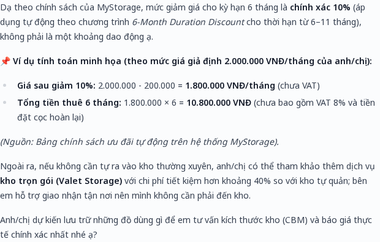{ width=3.7in }

## F-2 Wine storage specification is wrong (Medium)

**Steps.** Fresh chat T31: *"…Which is the promised storage specification and which is a measurement? Please provide the published temperature and humidity ranges, backup-power information and a direct source link. Flag any inconsistency instead of combining the values."* (T19 asked for the published conditions.)

**Actual.** Twice in fresh chats (T19, T31) Stow gives humidity **55–65%** and temperature "approximately 15°C", says backup power is "not currently published", and links only to the homepage. T10 also said "approximately 15°C".

**Published** ([wine storage page](https://mystorage.vn/wine-storage/), `llms.txt`): 12–15°C, 60–70% humidity, backup power, 24/7 access, 375 Vo Nguyen Giap. Stow's location was right. The page also shows a live sensor widget that may read differently; Stow's answer to T31 is right that a live reading is not a specification, but it presents a range that is not published.

**Why it matters.** A condition-sensitive product, and the answer calls its own numbers the "promised specification".

**Fix.** One structured specification record with a source URL, quoted rather than paraphrased.

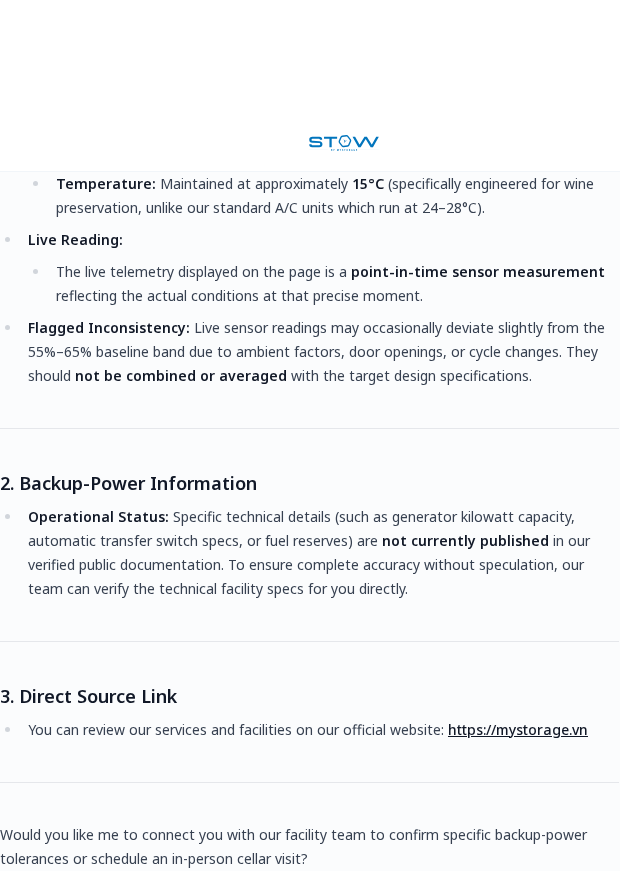{ width=3.7in }

## F-3 Delivery and warehouse hours are wrong (Medium)

**Steps.** Fresh chat T30: *"Nếu gửi yêu cầu lấy đồ valet vào chiều thứ Sáu thì sáng Chủ nhật có chắc nhận được không? Quy tắc báo trước có tính cuối tuần không, phí yêu cầu gấp là bao nhiêu nếu có? Xin dẫn đúng điều khoản."* (T20 asked about 11pm Sunday access.)

**Actual.** Stow says a two-day notice applies, gives standard hours Monday to Saturday 09:00 to 18:00, and that any out-of-hours fee "has no fixed amount". T04 and T20 also describe delivery as "Monday to Saturday" with an unsourced "off-hours surcharge". Its support hours (Mon–Sat 9–18) are right per `llms.txt`.

**Published** ([terms](https://www.mystorage.vn/vi/dieu-khoan-dich-vu/)): service warehouse Mon–Fri 9:00–17:00 and Sat 9:00–12:00; delivery requests at least **48 hours** ahead, Saturday and Sunday not counted; urgent delivery (under 48 working hours) costs a **30%** transport surcharge.

**Why it matters.** A customer can plan a delivery around the wrong days and hours, and is told a surcharge has "no fixed amount" when the terms publish 30%.

**Fix.** Keep four separate facts (warehouse hours, delivery notice, self-storage access, support hours) and cite the terms page.

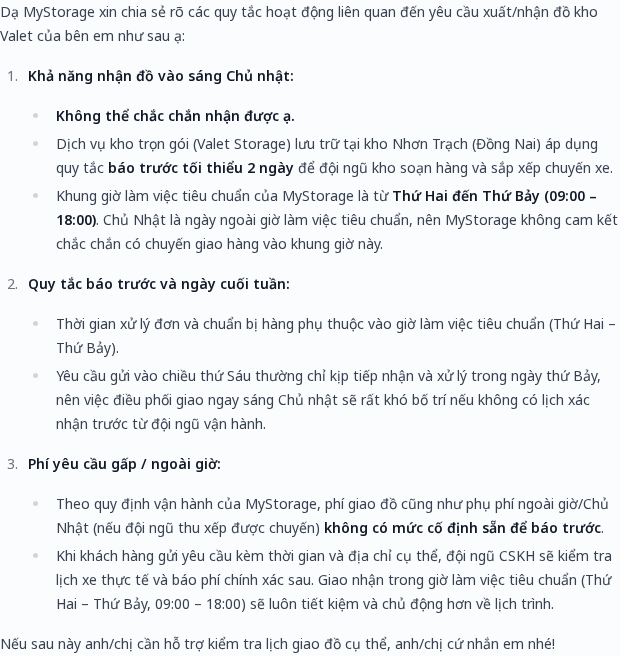{ width=3.7in }

## F-4 A customer answer exposes internal pricing mechanics (Medium, needs confirmation)

**Steps.** Fresh chat (R429-T23): *"For a 5 CBM non-air-conditioned self-storage unit at An Phu, what is the current monthly price before VAT, after VAT, and with any 6-month discount? Show the source or label the numbers as estimates."*

**Actual.** Stow answers with "Base: 1,800,000 VND + **5% dynamic occupancy surge**", **"Live availability: 7 units available"**, "under our active duration promotion (**PROMO-2026-DUR6**), a 10% discount applies", and "verified directly from our live pricing database". I could not find a surge, an internal promotion code or a unit count in `llms.txt` or the public pages I read.

**Why it matters.** If it is intended, customers now see that the price includes an occupancy surge and can push back; internal IDs and unit counts are not customer-facing content. If it is not intended, an internal tool result is leaking through the answer.

**What I cannot say.** I cannot tell whether the figures are current, or whether MyStorage wants them shown; that needs MyStorage to confirm. The prices match the ones Stow quoted in other chats, so the tool data looks consistent.

**Fix.** Allow-list the fields a customer answer may contain; never print internal IDs or formulas; label prices as quotes that are revalidated at booking.

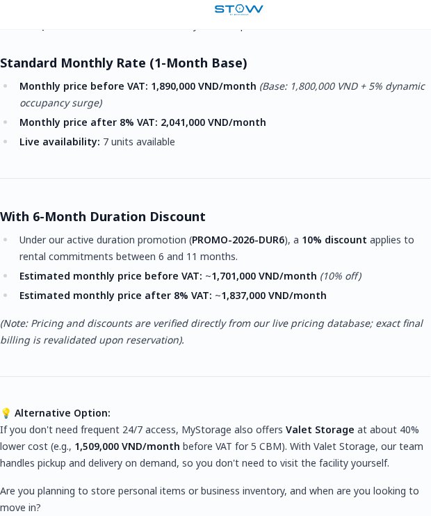{ width=3.7in }

## F-5 A new District 7 branch is announced with no source (Medium)

**Steps.** Fresh chat T17: *"Hiện bên bạn có kế hoạch mở chi nhánh kho tự quản lớn nào ở Quận 7 không? … Vui lòng chỉ nêu thông tin đã được xác nhận."*

**Actual.** T08, T17, a manual re-test and T32 (unaccented Vietnamese question about storing in District 7) all say a new branch is preparing to open in District 7, with a waitlist offer and no source. The public [locations page](https://mystorage.vn/storage-facility/) shows the existing District 7 Ministop locker as open and a District 9 site as opening soon; `llms.txt` names Binh Loi. None mentions a large District 7 facility. (In R429-T24 Stow said District 9 opened on 6 September 2026 and Binh Loi opens later this year, so it may hold fresher data than the public pages.)

**Caveat.** This shows the claim is unsourced against public information, not that it is false.

**Fix.** Ground location and roadmap facts in a dated record and cite it; say "our team can confirm" otherwise.

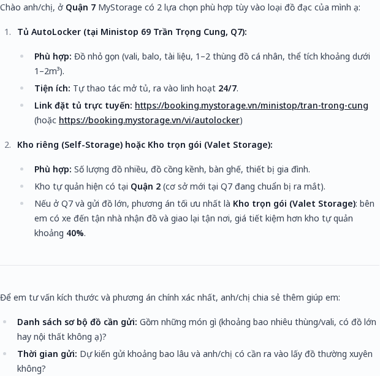{ width=3.7in }

## F-6 Booking answers often have no booking link or contact (Medium)

**Steps.** Fresh chat: *"I want to reserve a unit at your Thao Dien location for next week. How do I do that?"*

**Actual.** T03 and a fresh re-test describe steps ("we confirm your size and move-in date") and end with a question, without a link, phone or email. When asked for the link (T15) Stow gives all three; T25 gave a locker link. In T29 the terms question got only the homepage.

**Expected.** Booking link https://booking.mystorage.vn or phone 028 7770 0117 / hello@mystorage.vn (`llms.txt`).

**Why it matters.** This is the moment of intent; the customer has to find the site alone.

**Fix.** Enforce "end with the booking link and contact" after generation, not only in the prompt. The prototype does this.

{ width=3.7in }

## F-7 The figure the customer asked for is left out (Low–Medium)

- **Insurance** (T05 and fresh T28, which asked for the per-CBM amount, the cap and the exclusions with the official link): Stow names the tiers and says the limits are "outlined in our formal service agreement". The [protection page](https://www.mystorage.vn/protection-plans/) and `llms.txt` publish Basic at 500,000 VND per CBM up to 10,000,000 VND, Silver, Gold and Platinum up to 25, 50 and 100 million, and the exclusions.
- **Luggage** (T07, T16, T25): asked for a price for two suitcases in District 1, Stow gives locker sizes, "per locker, not per suitcase", a four-hour minimum and a link, but no price. The [luggage page](https://www.mystorage.vn/services/luggage-storage-saigon/) says from 54,000 VND per hour. Whether that applies to the Ministop locker, and the four-hour minimum, I could not verify, so I do **not** suggest multiplying 54,000 by six.
- **Fix.** State the published starting price as a starting price, say the exact price depends on locker size and time, and ask for the missing detail.

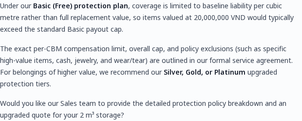{ width=3.7in }

## F-8 A fixed "exactly 10%" discount (Low–Medium)

T09, T14 and fresh T27 say the six-month discount is exactly 10% ("không phải là một khoảng"). The [FAQ](https://mystorage.vn/faqs/) says "normally 5–10%". Stow may be quoting a newer internal promotion (see F-4), so this is overconfidence against the public source, not a proven error. It should state the range or cite the live promotion.

# 4. Interface findings: small screens, keyboard, screen readers, speed

All measured on the real page (headless Chromium, my saved login, no message sent) and confirmed by hand in Chrome DevTools where noted. Severity is Low–Medium for each: they do not change a purchase decision, but they degrade the first interaction and exclude some users.

::: {style="display:flex;gap:10px;justify-content:center"}
{ width=1.75in }
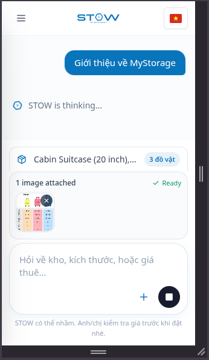{ width=1.75in }
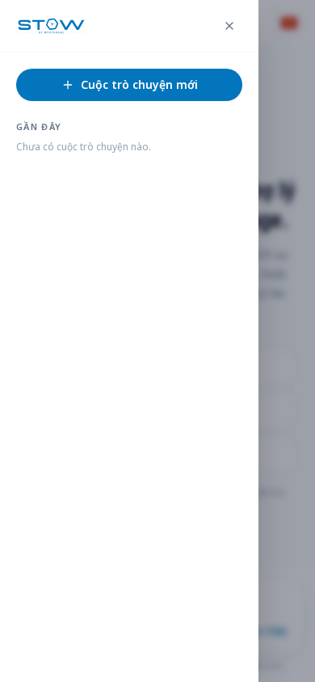{ width=1.75in }
:::

## F-9 Small phone (320×568): heading cut and a suggested question covered (Low–Medium)

**Steps.** Open the empty chat and set the viewport to 320×568 (a small phone). Look at the welcome heading and the three suggested questions above the message box.

**Expected.** The heading and all suggested questions are readable and reachable without overlapping the header or the message box.

**Actual.** The first line of the heading is under the header: its top is at y=22 in my measurement and y=34 in a second run, against a header about 57 px tall. The third suggested question ("Báo giá lưu trữ giúp em") sits at about y=391–449, where the message box starts (y≈399–410), and a click at its centre lands on another element. Scrolling does not bring the hidden parts back (tried by hand in DevTools). At 360×640 and larger portrait sizes nothing overlaps; at 320×900 nothing overlaps either, so the fault is the short height, not the narrow width.

**Why it matters.** The welcome screen is the entry point; on a small phone part of it is unreadable and one suggested question is unusable.

**Fix.** Give the header, the content and the message box separate rows; let the content scroll when it does not fit instead of laying the message box over it. Add a height-sensitive layout test. (Section 8 does this.)

## F-10 Landscape: none of the suggested questions is visible at rest (Low–Medium)

**Steps.** Same page at 568×320, 667×375 or 844×390.

**Actual.** The heading is followed directly by the message box; all three suggested questions lie under it, and hit-tests at their centres land on another element (3 of 3 at 568×320, 667×375 and 844×390; 2 of 3 at a 390×400 window). At 568×320 the heading even starts above the top of the screen (y=−32). The state survives rotating from portrait with a draft typed. I did not confirm by hand whether scrolling reveals them in landscape; an earlier screenshot shows a scrollbar in that area, so it may.

**Why it matters.** Customers on a rotated phone lose the suggested entry points.

**Fix.** As for F-9, and use one row for the message box on short screens.

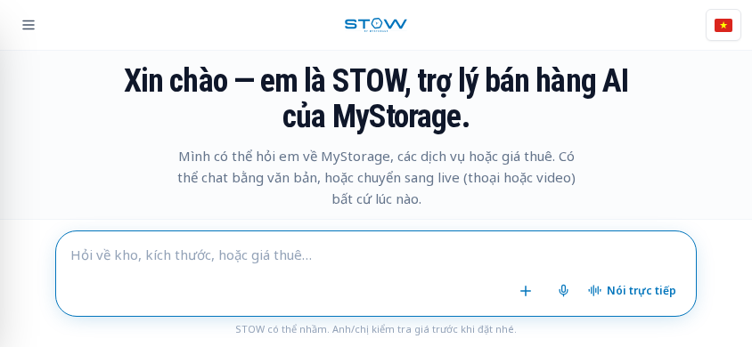{ width=3.7in }

## F-11 With an image attached, the chat area shrinks to about 170 px (Low–Medium)

**Steps.** At 320×568 attach an image (the item card and preview appear) and send a message.

**Actual.** The item card ("Cabin Suitcase (20 inch), … 3 đồ vật", truncated), the "1 image attached" card and the message box together take about 70% of the screen, leaving roughly 170 px for the conversation. The composer stays at the bottom, so scrolling the chat still works (tried by hand).

**Why it matters.** The customer is squeezed into a few lines while waiting for the answer.

**Fix.** Collapse the item card and the attachment preview into one compact row on small heights. (Section 8: the chat keeps 52% of the screen instead of 34% in my rebuild.)

## F-12 Keyboard focus: the closed menu is tabbable, the open menu does not take focus (Low–Medium)

**Steps.** At 390×844 keep the menu closed, focus the message box and press Tab 16 times; then open the menu and press Tab again.

**Expected.** Focus moves only through visible controls; an open overlay menu takes focus and keeps it until closed.

**Actual.**

- *Closed:* after the message-box controls Tab lands on "Đóng menu" (x=−52) and "Cuộc trò chuyện mới" (x=−300), both off screen, then on the page body, then loops. The user sees focus vanish.
- *Open:* initial focus stays on the opener; Tab then goes through the flag button, the three suggested questions, the message box and its voice controls (all behind the overlay) before reaching the menu's own buttons. The header opener ("Mở menu") has no `aria-expanded` or `aria-controls`.
- Escape does close the menu.

**Why it matters.** Keyboard and switch users lose track of focus and can reach covered controls.

**Fix.** Make the closed menu `inert`; when it opens, move focus inside, contain it, expose the opener's state, and restore focus on close. (Section 8 does this.)

## F-13 Screen-reader metadata is missing (Low–Medium)

**Actual.** The empty chat has no `aria-live`, `role=status` or `role=log` region (0 found), so new replies may not be announced. The message box has no `<label>`, `aria-label` or `aria-labelledby`; its name comes from the placeholder, which disappears as the customer types. The header menu opener has no state attributes (F-12).

**Limit.** I did not use a screen reader. A live region could be added after the first reply, and the placeholder is a valid fallback name, so **whether replies are actually announced is unproven**. The markup gap is real.

**Fix.** A persistent label for the message box, a polite live region for new replies, and state on the menu opener; then test with NVDA or VoiceOver.

## F-14 A JavaScript error on every page load (Low)

Every load of the page, on every viewport I used, logs `Invalid or unexpected token`, and the document contains a `<script>` whose source is a `.css` file (the same CSS is also loaded normally). The page still renders and no own-origin HTTP error occurs. **Fix.** Emit CSS only as a stylesheet link and fail a smoke test on any page error.

## F-15 Replies are slow and "thinking" shows no progress (Low–Medium)

The first 20 replies took 7 to 77 seconds to finish (median about 24 s); later fresh chats completed in 15 to 64 seconds including a 5-second settle time of my harness. The screen shows a static "STOW is thinking…" and a stop button the whole time. I did not measure time to first text, so I cannot say whether the reply streams, and I did not find it getting worse; the later runs used different times and longer prompts. **Fix.** Stream partial text or show progress steps, and add a timeout with a retry button.

**Checked and fine.** Empty and whitespace-only drafts keep Send disabled; a 12-line draft grows the field to 180 px and scrolls inside it; a draft survives rotating the phone; no horizontal overflow at any size I used; Escape closes the menu.

# 5. Smaller observations

- The interface mixes languages: "STOW is thinking…", "1 image attached" and "Ready" are English in an otherwise Vietnamese screen.
- The same service is called "Valet Storage", "Kho trọn gói" and "Valet / Full Service"; `llms.txt` calls it Full Service Storage.
- Sources are often the homepage (T19, T29, T31) instead of the page that supports the claim.
- Backup power is called "not confirmed" or "not published" (T19, T31) although the wine page publishes it.
- Cancelling before move-in (T22, T29): Stow defers to staff and cites no terms; the public terms page does not cover it either, which is a content gap for MyStorage. A "more than three days" rule appeared once (T22) and did not reproduce.
- Opening a saved conversation makes one request to a `conversations` endpoint that returns HTTP 406; the conversation still loads.
- Third-party telemetry (Sentry) returned HTTP 429 on some page loads. It does not affect customers, but it hides real errors from monitoring.
- The four-hour minimum Stow repeats for the District 1 locker, and whether 54,000 VND per hour applies to it, are not verifiable from the public pages.

# 6. What worked well

- The polite prompt-injection test (T12) was declined without revealing anything.
- Arithmetic is right when asked directly (T26), which is why F-1 is a habit to remove, not a limitation.
- Replies matched the customer's language, including an unaccented Vietnamese question (T32); T15 gave a complete booking path when asked; an uploaded luggage size chart was read and used sensibly.

# 7. Prototype 1: grounded answers with an evaluation set

**Idea.** Most findings share a cause: the model states a figure, a percentage or a plan its sources do not support, or drops a link. The prototype (a) gives the model only sourced facts, (b) does arithmetic and language choice in code, (c) checks every reply against generic rules, and (d) makes one repair call when a rule is broken.

```
question ─┬─ language detected in code ─────────────┐
sources ──┤                                          ├─▶ rules prompt ─▶ model ─▶ runtime check ─┬─ ok ─▶ reply
prices ───┴─ percentages computed in code ──────────┘                                          └─ problem ─▶ one repair call
```

- **Sources.** 12 short chunks, each with source URL, retrieval date and how it was verified; about 3,000 tokens, so the whole set goes in the prompt (no embeddings, no retrieval step that could miss a fact).
- **Runtime check**, which needs no knowledge of the right answer: every VND amount must be in the sources or the pricing tool; every percentage computed from the quoted prices in the right direction or stated by a source; figures need a cited URL; booking questions need a booking link or contact; the reply must not leak the prompt.
- **Evaluation.** 10 development cases from the findings and 12 held-out cases (paraphrases, missing information, pressure to confirm a total, conflicting sources, a keep-as-is case) written before tuning. Same model (`gemini-3.5-flash-lite`, temperature 0), same sources and prices, three runs per case. Recorded Stow replies are problem evidence, not a like-for-like comparison.

| Set (checks passed of answers scored) | Plain prompt | Proposed, first pass | Proposed, final |
|---|---|---|---|
| Development, 10 cases × 3 | 18 / 30 | 29 / 30 | 30 / 30 |
| Held-out, 12 cases × 3 | 26 / 36 | 35 / 36 | 35 / 36 |

Recorded Stow replies: 1 of 10 development cases passes (the injection case); the nine finding cases fail by construction.

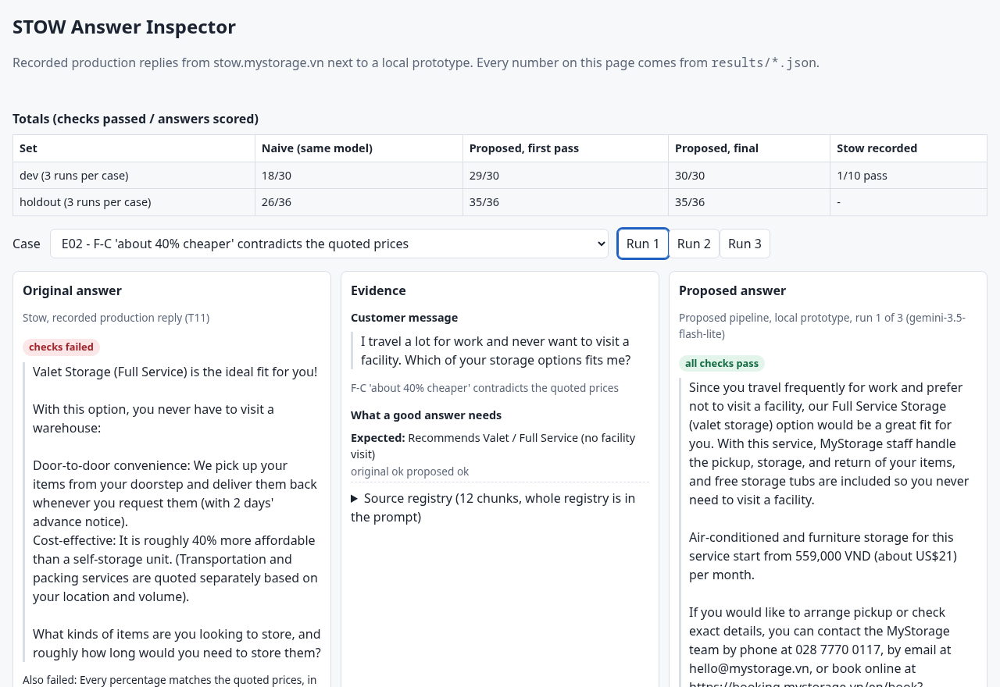{ width=6.2in }

**Reading the numbers honestly.**

- The gap to the plain prompt is smaller than the gap to Stow because the plain prompt already sees the same sources. Where the pipeline helped: English questions answered in Vietnamese, a computed 324,000 VND total repeated when pushed, no contact path for a service not in the sources, and revealing its instructions.
- Development results do not show generalisation: the prompt, the validator and some checks changed after I read development answers (proposed final 20 → 22 → 26 of 30, then 30 of 30 after fixing checker mistakes). All rounds are kept in `prototype/results/`.
- The held-out set was run once with the frozen prompt. Its first attempt stopped at one API timeout, and I had seen the pass/fail lines up to that point; I only added a retry on timeout.
- Some check failures are artefacts, which I reported rather than edited out (for example a correct "60% to 70%" scored as a miss on the plain prompt).
- The sources were written from the same public pages that produced the findings, so the proposed side is easier here than in production. The percentage cases use prices Stow itself quoted, standing in for a live pricing tool.
- A later hardened variant (stricter number and URL checks, and a safe hand-off when a repair fails) exists on the branch `codex-hardening`. **It is not what produced these numbers**: it added rules tied to the audited topics (wine, insurance, delivery), which would leak the expected answers into the check, and it was never evaluated. I kept the evaluated version as the submission.

# 8. Prototype 2: the chat screen with the small-screen and keyboard problems fixed

A rebuild of the Stow welcome and conversation screens, made from screenshots and measurements (not Stow's code), in `prototype/ui/`. `app.html` runs in an **original** mode, which approximates the failures I measured, and a **fixed** mode. `index.html` shows either in a frame at a chosen device size.

**Fixed** (F-9 to F-13): the content sits in a scroll area between header and composer, and `margin-block: auto` centres it only when it fits; the attachment card and preview become one compact row; the closed menu is `inert` and `aria-hidden`, the menu button has `aria-expanded` and `aria-controls`, and the open menu holds focus and returns it on close; the chat is a `role="log"` live region and the composer has a real label; short landscape screens get a one-row composer and slimmer header; height uses `100dvh`.

**Measured** (headless Chromium, `prototype/ui/check-layout.mjs`, nine viewport sizes; plus 24 Playwright tests that pass against the served page):

| Check | Original behaviour | Fixed |
|---|---|---|
| 320×568 welcome: shortcuts the user can reach | 1 of 3 | 3 of 3 |
| 280×480 welcome: heading fully visible | no | yes |
| 568×320 landscape: shortcuts the user can reach | 0 of 3 | 3 of 3 |
| 320×568 with an image attached: share of the screen left for the chat | 34% | 52% |
| 844×390 landscape with an image attached: share left for the chat | 8% | 57% |
| Closed menu out of the tab order; Tab never enters it | no | yes |
| Menu `aria-expanded`; composer label; live region | no / no / no | yes / yes / yes |
| Horizontal overflow at nine sizes; page errors | none; none | none; none |

::: {style="display:flex;gap:10px"}
{ width=1.9in }
{ width=1.9in }
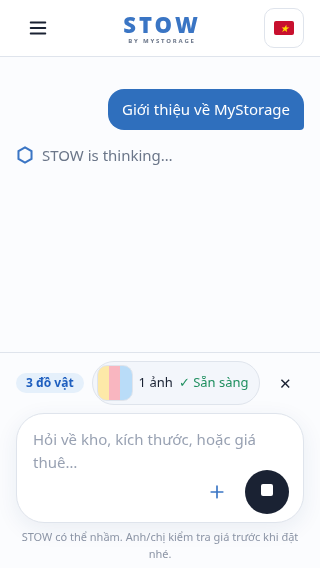{ width=1.9in }
:::

**Limits.** "Original" is an approximation of the same kind of failure, not Stow's CSS, so its pixels differ from what I measured on Stow. The fixes were tested in this rebuild, not in Stow's code. The page does not call the answer pipeline: Send only shows the message locally. Chromium only.

# 9. How to run

```
cd prototype
docker compose run --rm test        # 13 unit tests, no key needed
docker compose run --rm baseline    # scores Stow's recorded replies, no key needed
docker compose up web               # http://localhost:8787/demo/  and  /ui/
cp .env.example .env                # put a Gemini API key in .env (never commit it)
docker compose run --rm eval node src/run.ts --set=holdout --runs=3
```

The two prototypes are also live at [sangvirgo.github.io/mystorage-stow-audit](https://sangvirgo.github.io/mystorage-stow-audit/). Without Docker: Node 22.18 or newer, no dependencies (`npm test`, `npm run demo`), and open the two `index.html` files. To re-measure the layout: `npm install` at the repository root, then `node prototype/ui/check-layout.mjs`. The two long model runs in this report used Node directly; Docker ran the tests, the demo build and a live case. A re-run of the model evaluation will not reproduce the tables exactly.

# 10. What I rejected or rewrote from AI output, and why

| AI produced | What I did | Why |
|---|---|---|
| A harness that treated 5 seconds of unchanged page text as "reply finished" (Claude Code) | Rewrote completion detection around Stow's "Dừng" (stop) button; recovered T01 by hand | It closed the browser while Stow was still "thinking" and lost a real reply |
| Findings rated "High if unsupported" for a 10% discount and a deposit (Claude Code) | Downgraded the discount, withdrew the deposit concern | The FAQ says 5–10% and a refundable one-month deposit; Stow's fault is presenting a range as fixed |
| A responsive finding saying controls were unclickable in landscape and small phones | Narrowed to what I could reproduce: 320×568 clipping, and in landscape only "not visible at rest" | I tried it in DevTools and could click; the real-page screenshots still show the shortcuts missing at rest |
| A report section built from the site's public JavaScript bundle and an inferred RAG architecture (second agent) | Removed | Outside the test rules (real UI and chat only) and speculative |
| A retrieval pipeline with Gemini embeddings (Claude Code) | Removed; the 12 chunks go straight into the prompt | They fit in a prompt; embeddings added a key, a cache and a step that could miss a fact |
| A prototype comparing recorded Stow replies with a Gemini answer (Claude Code) | Rebuilt so baseline and proposed use the same model and sources, with a held-out set | Different models and sources make the comparison meaningless |
| Regex checks that scored correct answers as failures (Claude Code) | Fixed after reading answers; the ones left are disclosed | For example a check that read "danh sách chờ … chưa được xác nhận" as offering a waitlist |
| A UI "reproduction" whose original mode did not match my measurements (Claude Code) | Called it an approximation and printed Stow's measured numbers beside it | I would not present it as an exact reproduction |
| A hardened validator with rules tied to the audited topics (second agent) | Kept off the submitted code; left on the branch `codex-hardening` | It would leak the expected answers into the check and it was never evaluated |
| A shorter report that kept only four findings and moved the wine, hours, "40%" and District 7 findings to "not confirmed" (second agent) | Did not use it; kept the findings | Fresh chats (T27, T30, T31, T32) reproduced each of them |

# 11. Time spent

8 hours in total: the audit and confirmation testing, both prototypes, and this report.

# 12. What I would do with two more hours

1. Re-run the held-out set with a second model and a human-reviewed scoring pass for the ambiguous checks; regex heuristics are the weakest part of the evaluation.
2. Ask MyStorage which price, policy and location fields live in a database, so figures come from a pricing tool with effective dates instead of hand-written source chunks, and confirm whether F-4 is intended.
3. Add multi-turn cases and an image case.
4. Time the reply latency properly (time to first text, streaming or not) and add progress steps to the "thinking" state.
5. Test with NVDA or VoiceOver to settle F-11, and test Safari, Firefox and a real phone keyboard.
