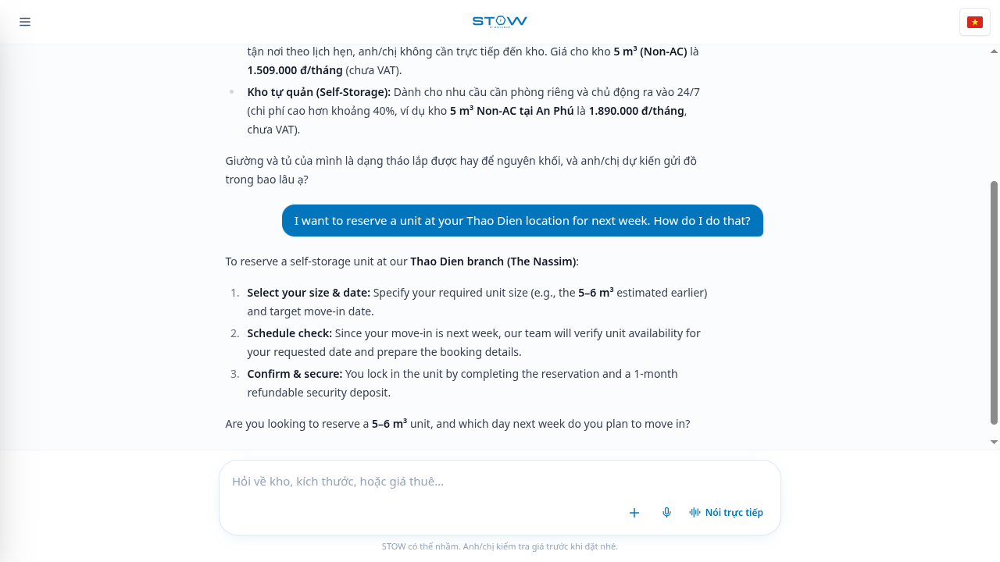
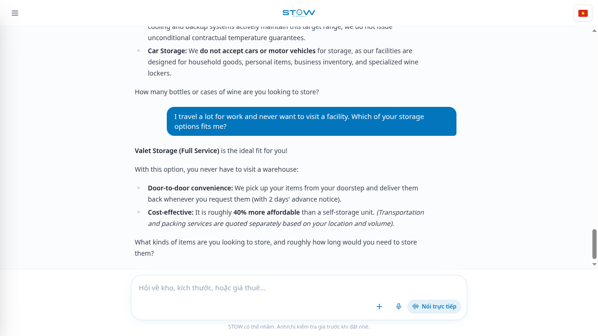
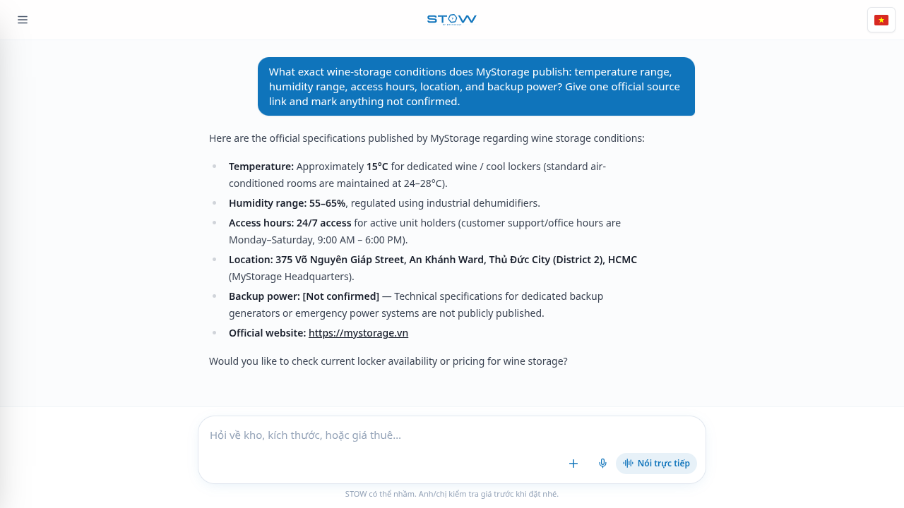
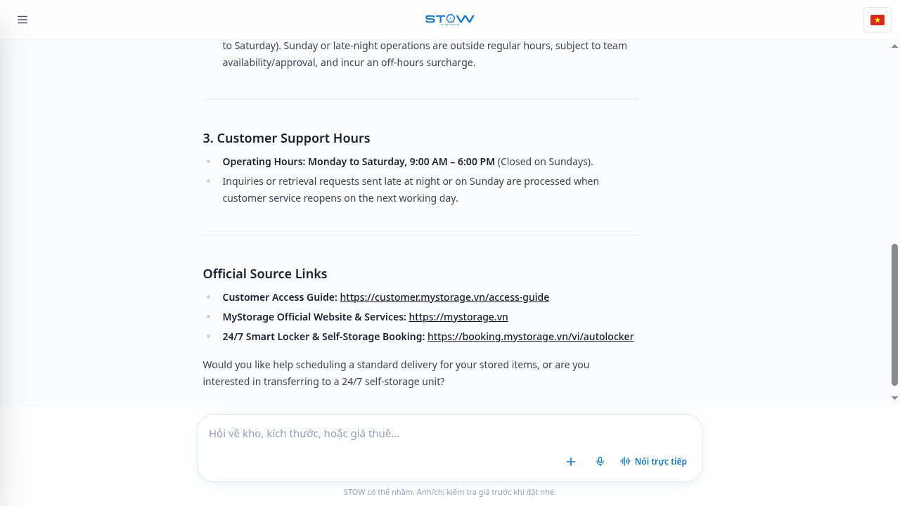
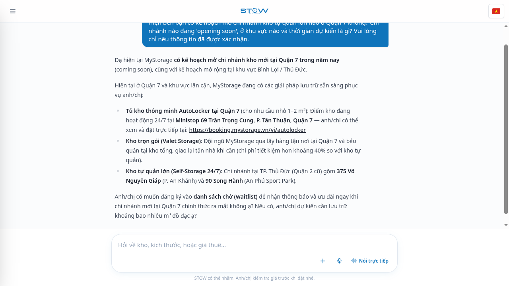
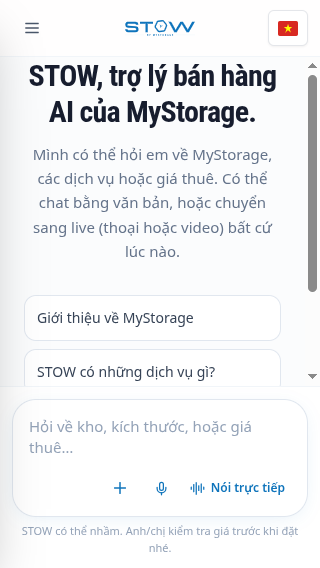
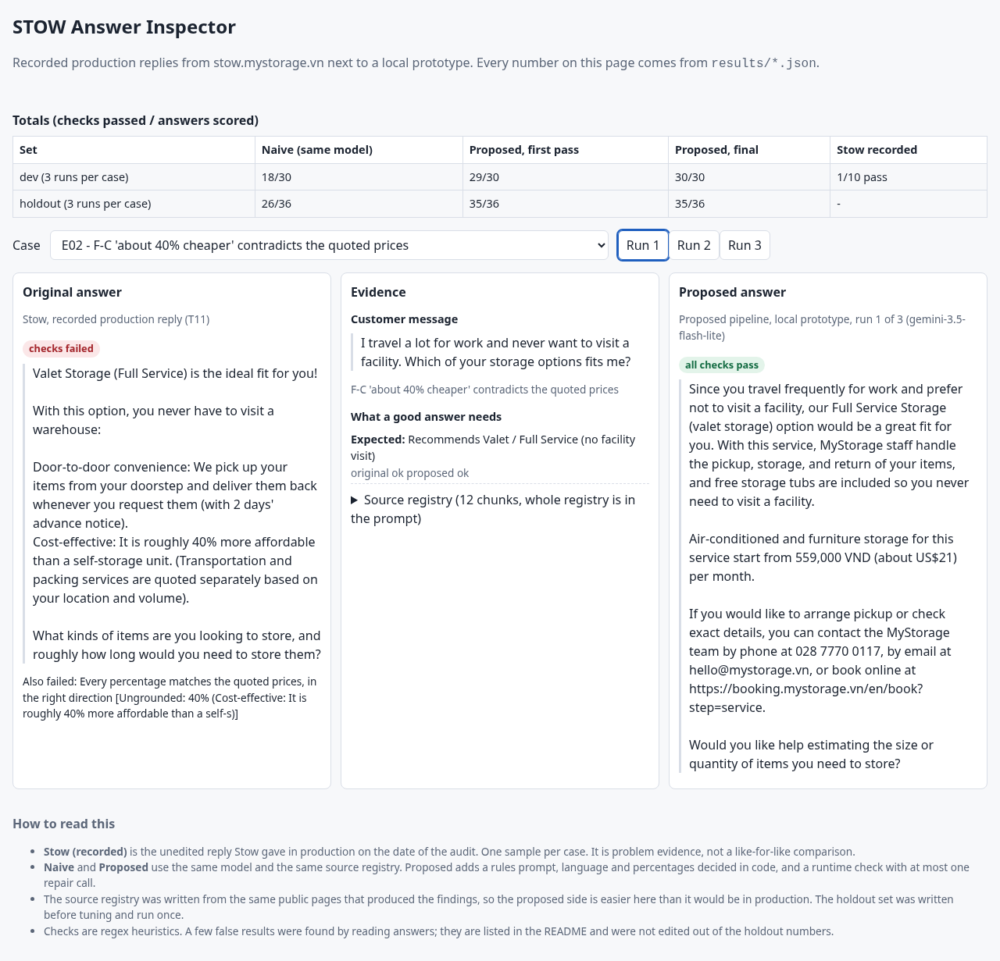
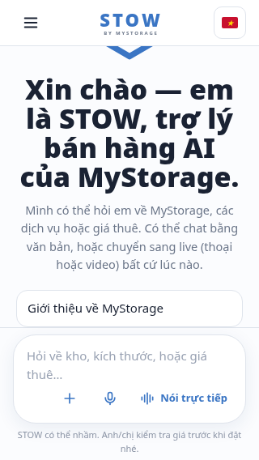
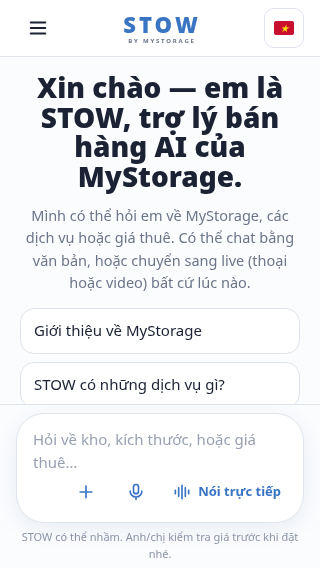
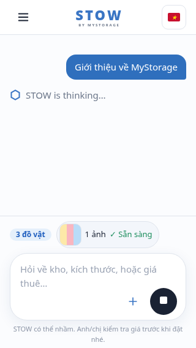

**Applicant:** Nguyen Luu Tan Sang · tansang.dev@gmail.com · 0379641599

**Code and demos:** [github.com/sangvirgo/mystorage-stow-audit](https://github.com/sangvirgo/mystorage-stow-audit) (folder `prototype/`; open `prototype/demo/index.html` and `prototype/ui/index.html` in a browser) · **Total time spent:** 8 hours (section 8)

# 1. Summary

I used stow.mystorage.vn as a customer, on my own account, one message at a time, and compared what Stow said with `llms.txt` and the public mystorage.vn pages. Stow is fluent and often right. The problems that matter are places where it states something more confidently than its sources allow, or leaves out the one number or link the customer asked for.

The five findings I would fix first, all reproduced in fresh chats:

1. **Booking answers often end without a booking link, phone or email** (F-1, Medium). The customer asked how to reserve and had to find the site alone.
2. **"About 40% cheaper" for valet contradicts Stow's own prices** (F-2, Medium). Its own quotes give 20 to 29%.
3. **Wine storage specs are wrong** (F-3, Medium): "55–65% humidity, about 15°C", against a published 60–70% and 12–15°C.
4. **Warehouse and delivery hours are wrong** (F-4, Medium): delivery "Monday to Saturday", an unsourced "off-hours surcharge", against published Mon–Fri 9–17, Sat 9–12 and 48 hours' notice.
5. **Key figures are left out**: insurance limits (F-5, Medium) and the luggage starting price (F-6, Low–Medium). A District 7 branch is announced with no source (F-7, Medium).

**Prototypes.** (1) A grounded-answer pipeline and an evaluation set (10 development and 12 held-out cases), run with the same model against a plain prompt. On the held-out set the proposed pipeline passed 35 of 36 answers against 26 of 36 for the plain prompt. I explain below why that gap is smaller than the gap to Stow, what the numbers cannot show, and which check results I found to be artefacts. (2) A rebuild of the Stow chat screen with the responsive and accessibility problems fixed, next to an approximation of the original behaviour, with a layout check across nine screen sizes.

# 2. Scope and method

**Scope.** Accuracy against `llms.txt` and public pages, pricing, booking, locations and hours, ambiguous requests, Vietnamese, English and mixed input, unsupported claims, one polite prompt-injection test, error and empty states, mobile and accessibility.

**How I tested.**

- Real UI only, my own logged-in account, headed Chromium driven by a small Playwright harness. One message at a time, at least 65 seconds apart, no retries. The harness stops on HTTP 429, repeated 5xx, a login redirect or a CAPTCHA. It records the message before sending so nothing is ever sent twice. No booking, payment or upload was made by the harness.
- 12 planned messages (T01 to T12, of which T12 is the single polite prompt-injection test), then follow-up messages in fresh chats (T13 to T22). The harness logged 24 submissions in total (T01 to T24). T18 timed out without a capture. T23 and T24 were stopped by the guard when a third-party telemetry endpoint (Sentry) returned HTTP 429; neither was retried and no reply was captured for them. Eight further prepared messages (T25 to T32) were never sent. T01's reply was recovered by hand because my first harness version closed the browser while Stow still showed "thinking".
- I also sent about ten further messages by hand to confirm findings in fresh chats, one of them an image upload (a luggage size chart, which Stow read sensibly). That makes roughly 34 messages in total, well above the 12 I first planned; the extra ones were needed to separate real findings from artefacts of the shared chat.
- Read-only checks (no message) measured layout at several viewport sizes, keyboard order and ARIA structure, and I tried the small-screen cases by hand in Chrome DevTools.
- Facts come from `llms.txt` (read in full) and public pages. Several pages were read through a web-fetch summary, so quotes in this report should be re-read on the live page before anyone relies on them.

**Limits.** T02 to T12 shared one chat, so later replies saw earlier ones; I re-tested the findings in fresh chats. No real screen reader was used. Only Chromium was used. Model answers vary between runs.

**A second AI agent** also took read-only UI measurements and drafted an earlier version of this report. I checked its claims against the product and public pages, and removed the ones I could not support (section 7).

# 3. Findings that changed a customer's decision

Severity: High means a customer may make a materially wrong purchase or trust decision; Medium means confusion, lost conversion or a missing caveat; Low is narrow or cosmetic. I rated nothing High.

## F-1 Booking answer omits the booking link and contact (Medium)

**Steps.** In a fresh chat send: *"I want to reserve a unit at your Thao Dien location for next week. How do I do that?"*

**Expected.** Booking link https://booking.mystorage.vn or phone 028 7770 0117 / hello@mystorage.vn (`llms.txt`).

**Actual.** T03 and a fresh re-test describe steps ("we confirm your size and move-in date") and ask a question, with no link, phone or email. When I explicitly asked for the link (T15) Stow gave all three.

**Why it matters.** This is the moment of intent. The customer has to find the site alone.

**Fix.** Make "end with the booking link and contact" a rule enforced after generation, not only in the prompt. The prototype does this.

{ width=4.2in }

## F-2 "About 40% cheaper" contradicts Stow's own prices (Medium)

**Steps.** Fresh chat: *"I travel a lot for work and never want to visit a facility. Which of your storage options fits me?"* Reply: valet is "roughly 40% more affordable than a self-storage unit".

**Evidence.** Stow's own 5 CBM prices (T13 and two re-tests): AC valet 1,892,000 vs self-storage 2,657,000 VND (valet 28.8% lower); Non-AC 1,509,000 vs 1,890,000 (valet 20.2% lower). "40%" is only right as "self-storage is 40.4% higher" for AC. The same "40%" appeared unprompted in T09, T11, T17 and one more fresh chat. When asked to compute, Stow gets it right, so the error is a habit, not an inability.

**Why it matters.** It is the number a customer uses to choose between two products.

**Fix.** Compute percentages in code from the two prices shown and state both prices.

{ width=4.2in }

## F-3 Wine storage specification is wrong (Medium)

**Steps.** Fresh chat T19: *"What exact wine-storage conditions does MyStorage publish: temperature range, humidity range, access hours, location, and backup power? Give one official source link and mark anything not confirmed."*

**Actual.** "Approximately 15°C", humidity "55–65%", backup power "not confirmed", source link: homepage only. **Published** ([wine storage page](https://mystorage.vn/wine-storage/), `llms.txt`): 12–15°C, 60–70%, backup power, 24/7 access, 375 Vo Nguyen Giap. The location Stow gave was right. T10 also said "approximately 15°C".

**Why it matters.** A condition-sensitive product, and the reply calls itself "official". (The public page also shows a live sensor widget that may read differently; the answer should say so rather than invent a range.)

**Fix.** One structured spec record with a source URL, quoted rather than paraphrased.

{ width=4.2in }

## F-4 Warehouse and delivery hours are wrong (Medium)

**Steps.** Fresh chat T20: *"Can I collect items from the Nhon Trach warehouse at 11pm on Sunday? Please distinguish warehouse access, delivery requests, and support hours, with source links."*

**Actual.** Stow correctly says no 11pm access, and its support hours (Mon–Sat 9–18) match `llms.txt`. But it says deliveries are scheduled "Monday to Saturday" and mentions an "off-hours surcharge". The [terms](https://www.mystorage.vn/vi/dieu-khoan-dich-vu/) say: service warehouse Mon–Fri 9:00–17:00 and Sat 9:00–12:00; delivery requests at least 48 hours ahead, weekends not counted; urgent delivery (under 48 working hours) costs 30% more transport. T04 made the same "Mon–Sat 9–18" claim for delivery.

**Why it matters.** A customer can turn up or book for a time when nobody is there.

**Fix.** Keep four separate facts (warehouse hours, delivery notice, self-storage access, support hours) and cite the terms page.

{ width=4.2in }

## F-5 Insurance answer gives no figures (Medium) and F-6 luggage answer gives no price (Low–Medium)

- **Insurance** (T05 and a fresh re-test): "the exact coverage depends on the tier". The [protection page](https://www.mystorage.vn/protection-plans/) and `llms.txt` publish Basic at 500,000 VND per CBM up to 10,000,000 VND, and Silver, Gold and Platinum up to 25, 50 and 100 million VND, with exclusions. Stow gave none of them.
- **Luggage** (T07, T16 and two re-tests): asked "how much for 2 suitcases, 6 hours, District 1", Stow gave locker sizes, a "4-hour minimum" and a link, but no price. The [luggage page](https://www.mystorage.vn/services/luggage-storage-saigon/) says from 54,000 VND per hour. It is not clear that this price applies to the Ministop locker, and the 4-hour minimum is not on the static booking page, so I do **not** recommend multiplying 54,000 × 6.
- **Fix.** State the published starting price as a starting price, say the exact price depends on locker size and time, and ask for the missing detail.

## F-7 A District 7 branch is announced with no source (Medium)

**Steps.** Fresh chat T17: *"Hiện bên bạn có kế hoạch mở chi nhánh kho tự quản lớn nào ở Quận 7 không? … Vui lòng chỉ nêu thông tin đã được xác nhận."*

**Actual.** T08, T17 and a fresh re-test: a large self-storage branch will open in District 7 "this year", "an official plan", with a waitlist offer and no source. The [locations page](https://mystorage.vn/storage-facility/) shows the existing District 7 Ministop as open and a District 9 site as opening soon; `llms.txt` names Binh Loi instead. Those two sources disagree with each other, but neither mentions District 7.

**Caveat.** This shows the claim is unsourced and inconsistent with public information, not that the plan is false.

{ width=4.2in }

# 4. Other findings

| ID | Finding | Severity | Status |
|---|---|---|---|
| F-8 | Six-month discount stated as a fixed 10% (T09, T14); the [FAQ](https://mystorage.vn/faqs/) says "normally 5–10%" | Low–Medium | Confirmed. Stow's internal price data may be newer than the FAQ. |
| F-9 | Overstay fee not stated for the District 1 locker; the [booking page](https://booking.mystorage.vn/ministop/tran-khac-chan) states 108,000 VND for 2 accesses | Low–Medium | Confirmed. The "4-hour minimum" Stow repeats is not verified. |
| F-10 | The closed menu drawer stays in the keyboard tab order at 390 px: Tab reaches "Đóng menu" and "Cuộc trò chuyện mới" while both are off screen (no `aria-hidden`, no `inert`) | Low–Medium | Confirmed by measurement |
| F-11 | No `aria-live` or `role=status` region for chat replies; the composer has no label (its name is the placeholder) | Low–Medium | Confirmed in the DOM. No screen reader was used, so announcement failure is an inference. |
| F-12 | A JavaScript error, "Invalid or unexpected token", on every page load; a `<script>` whose source is a `.css` file. The page still renders. | Low | Confirmed |
| F-13 | At 320×568 the first line of the welcome heading is cut under the header and the third shortcut sits behind the composer. Fine from 360×640 in portrait. Scrolling does not bring the clipped parts back at 320×568 (tried by hand in DevTools). In landscape (844×390, 667×375, 568×320) the three shortcuts are not visible at rest: `evidence/round5/U07.png` shows the heading, the paragraph and then the composer, and hit-tests at the shortcut centres land elsewhere. I did not confirm by hand whether scrolling reveals them in landscape; an earlier screenshot shows a scrollbar in that area, which suggests it may. | Low–Medium | Confirmed at 320×568 (heading top y=22 under a 57 px header, third shortcut y=403–449, composer textbox y=410–464). Landscape: not visible at rest; scrolling unconfirmed. |
| F-14 | At 320×568 with an image attached, the item card, preview and composer leave about 170 px for the chat | Low–Medium | Confirmed on screenshots (DevTools) |
| F-15 | Replies take a median 24 s, minimum 7 s, maximum 77 s to finish (20 replies); the screen shows a static "STOW is thinking…" | Low–Medium | Range measured by the harness (time until the reply finished), not proven to be getting worse. I did not time the suggested chips by hand. |

{ width=2.2in }

**What worked well.** The polite prompt-injection test (T12) was declined without revealing anything. Replies matched the customer's language. T15 gave a complete booking path when asked. An uploaded luggage size chart was read and used sensibly.

# 5. Prototype 1: grounded answers with an evaluation set

**Idea.** Most findings share a cause: the model states a figure, a percentage or a plan that its sources do not support, or drops a link. So the prototype (a) gives the model only sourced facts, (b) does arithmetic and language choice in code, (c) checks every reply against generic rules, and (d) makes one repair call when a rule is broken.

```
question ─┬─ language detected in code ─────────────┐
sources ──┤                                          ├─▶ rules prompt ─▶ model ─▶ runtime check ─┬─ ok ─▶ reply
prices ───┴─ percentages computed in code ──────────┘                                          └─ problem ─▶ one repair call
```

- **Sources.** 12 short chunks, each with source URL, retrieval date and how it was verified. About 3,000 tokens, so the whole set goes in the prompt: no embeddings and no retrieval step that could miss a fact.
- **Runtime check** (needs no knowledge of the right answer): every VND amount must be in the sources or the pricing tool; every percentage must be computed from the quoted prices in the right direction or be stated by a source; figures need a cited URL; booking questions need a booking link or contact; the reply must not leak the prompt.
- **Evaluation.** Each case has the customer message, expected facts, prohibited claims and behavioural properties (booking path, reply language, no prompt leak, grounded percentages, asks a clarifying question). 10 development cases come from the findings; 12 held-out cases (paraphrases, missing information, pressure to confirm a total, conflicting sources, a keep-as-is case) were written before tuning.
- **Comparison.** Same model (`gemini-3.5-flash-lite`, temperature 0), same sources, same prices, three runs per case. Baseline: one plain instruction. Proposed: the pipeline above. Recorded Stow replies are shown only as problem evidence, not as a like-for-like comparison.

**Results** (as run on 19 September 2026; checks passed of answers scored):

| Set | Plain prompt | Proposed, first pass | Proposed, final |
|---|---|---|---|
| Development, 10 cases × 3 | 18 / 30 | 29 / 30 | 30 / 30 |
| Held-out, 12 cases × 3 | 26 / 36 | 35 / 36 | 35 / 36 |

Recorded Stow replies: 1 of 10 development cases passes (the injection case); the nine finding cases fail by construction.

{ width=6.4in }

**Reading the numbers honestly.**

- The gap to the plain prompt is smaller than the gap to Stow because the plain prompt already sees the same sources. Where the pipeline helped was English questions answered in Vietnamese, the model repeating a computed 324,000 VND total when pushed, giving no contact path for a service not in the sources, and declining to reveal its instructions.
- Development results are not evidence of generalisation: the prompt, the validator and some checks were changed after reading development answers (proposed final 20 → 22 → 26 of 30 across rounds, then 30 of 30 after fixing checker mistakes). All rounds are kept in `prototype/results/`.
- The held-out set was run once with the frozen prompt. Its first attempt stopped at one API timeout part-way, and I had seen the pass/fail lines up to that point before re-running; I changed only the retry on timeout.
- Some check failures are checker artefacts, which I reported rather than edited out: for example a correct "60% to 70%" scored as a miss (holdout H12, plain prompt), and "Binh Lợi" with mixed diacritics missed by a pattern (H09). Details in the README.
- The sources were written from the same public pages that produced the findings, so the proposed side is easier here than in production. The comparison prices for the percentage cases are numbers Stow itself quoted, standing in for a live pricing tool.
- The runtime check fired often on the held-out set (mostly a missing source URL) and every repaired reply passed afterwards. It also raised one false alarm during development (a "5% đến 10%" range), a bug in my validator that I fixed.

# 5b. Prototype 2: the chat screen with the responsive and accessibility problems fixed

**What it is.** A rebuild of the Stow welcome and conversation screens, made from screenshots and measurements (not Stow's code), in `prototype/ui/`. `app.html` runs in two modes: **original**, which approximates the failures I measured on Stow, and **fixed**, the same look with the fixes. `index.html` shows either mode in a frame at a chosen device size, from 280×480 up to desktop.

**What is fixed** (findings F-10, F-11, F-13 and F-14):

- The content sits in a scroll area between the header and the composer instead of being centred in a fixed area with the composer laid over it. `margin-block: auto` centres it only when it fits, so nothing is unreachable when it does not (F-13).
- With an image attached, the item card and the preview become one compact row, so the chat keeps room (F-14).
- The closed menu is `inert` and `aria-hidden`; the menu button has `aria-expanded` and `aria-controls`; Escape closes it and focus returns to the button (F-10).
- The chat is a `role="log"` live region and the composer has a real label (F-11).
- Short landscape screens get a one-row composer and a slimmer header. Height uses `100dvh`, so mobile browser bars do not hide the composer.

**Measured** (headless Chromium, `prototype/ui/check-layout.mjs`, full tables in `prototype/ui/layout-results.md`):

| Check | Original behaviour | Fixed |
|---|---|---|
| 320×568 welcome screen: shortcuts the user can reach | 1 of 3 | 3 of 3 |
| 280×480 welcome screen: heading fully visible | no | yes |
| 568×320 landscape: shortcuts the user can reach | 0 of 3 | 3 of 3 |
| 320×568 with an image attached: share of the screen left for the chat | 34% | 52% |
| 844×390 landscape with an image attached: share left for the chat | 8% | 57% |
| Closed menu out of the tab order; Tab never enters it | no | yes |
| Menu `aria-expanded`; composer label; live region | no / no / no | yes / yes / yes |
| Horizontal overflow at nine viewport sizes; page errors | none; none | none; none |

::: {style="display:flex;gap:10px"}
{ width=1.9in }
{ width=1.9in }
{ width=1.9in }
:::

**Limits, stated plainly.** "Original" is an approximation of the same kind of failure, not Stow's own CSS, so its exact pixels differ from what I measured on Stow (heading top y=22, third shortcut y=403–449 at 320×568). The fixes have been tested in this rebuild, not in Stow's code; they show what a fix should do, and the check script can be pointed at the real page's selectors. Chromium only: no Safari, Firefox, real device or on-screen keyboard, and no screen reader.

# 6. How to run the prototypes

```
cd prototype
docker compose run --rm test        # 13 unit tests, no key needed
docker compose run --rm baseline    # scores Stow's recorded replies, no key needed
cp .env.example .env                # put a Gemini API key in .env
docker compose run --rm eval node src/run.ts --set=holdout --runs=3
docker compose run --rm demo        # rebuilds demo/index.html
```

Docker runs the tests, the baseline scoring, the demo build and (with a key) the live evaluation; I ran a live case through the container to confirm it. The full development and held-out runs in this report were executed with Node directly (`node --env-file=.env src/run.ts --set=holdout --runs=3`). Without Docker: Node 22.18 or newer, no dependencies (`npm test`, `npm run demo`). Open `prototype/demo/index.html` (answer inspector) and `prototype/ui/index.html` (responsive fix) in any browser. To re-measure the layout: `npm install` at the repository root, then `node prototype/ui/check-layout.mjs`. A re-run of the model evaluation will not reproduce the tables exactly because model output varies.

# 7. What I rejected or rewrote from AI output, and why

| Claude Code produced | What I did | Why |
|---|---|---|
| A harness that treated 5 seconds of unchanged page text as "reply finished" | Rewrote completion detection around Stow's "Dừng" (stop) button; recovered T01's lost reply by hand | It closed the browser while Stow was still "thinking" and lost a real reply. A "Gửi visible" wait would also have timed out. |
| Candidate findings rated "High if unsupported": a possibly invented 10% discount and deposit | Downgraded the discount, withdrew the deposit concern | The FAQ says 5–10% and a refundable 1-month deposit. Stow's fault is presenting a range as fixed. |
| A responsive finding saying controls were unclickable in landscape and small phones | Narrowed to what I could reproduce: 320×568 clipping; landscape kept only as "not visible at rest, scrolling unconfirmed" | I tried it in DevTools and could click, but a later real-page screenshot still shows the shortcuts missing at rest in landscape. |
| An earlier report section built from the site's public JavaScript bundle and an inferred "RAG architecture" | Removed | Outside the test rules (real UI and chat only), and speculative. |
| A retrieval pipeline with Gemini embeddings | Removed; the 12 source chunks go straight into the prompt | Twelve chunks fit in a prompt. Embeddings added a key, a cache and a step that could miss a fact. |
| A prototype comparing recorded Stow replies with a Gemini answer | Rebuilt so baseline and proposed use the same model and sources | Different models and sources make the comparison meaningless; Stow replies are now only problem evidence. |
| Regex checks that scored some correct answers as failures | Fixed after reading answers, disclosed in the README | For example a check that read "danh sách chờ … chưa được xác nhận" as offering a waitlist. |
| A rebuild of the Stow screen whose "original" mode showed the heading fully visible at 320×568, where Stow clips it | Reworded as an approximation and printed Stow's measured numbers beside it | The numbers did not match what I measured on Stow, and I would not present it as an exact reproduction. |

# 8. Time spent

| Activity | Hours |
|---|---|
| Whole assignment: audit, confirmation testing, both prototypes, report | 8 |
| **Total** | **8** |

# 9. What I would do with two more hours

1. Re-run the held-out set with a second model and a stricter, human-reviewed scoring pass for the ambiguous checks, since regex heuristics are the weakest part.
2. Multi-turn cases (T03 showed later replies depend on earlier chat) and an image case.
3. Measure the reply latency properly (time to first text, streaming or not) and add progress steps to the "thinking" state.
4. Test with a screen reader (NVDA or VoiceOver) to settle the live-region finding, and test Safari and Firefox on mobile.
5. Ask MyStorage which price and policy fields live in a database, so figures come from a pricing tool with effective dates instead of hand-written source chunks.
